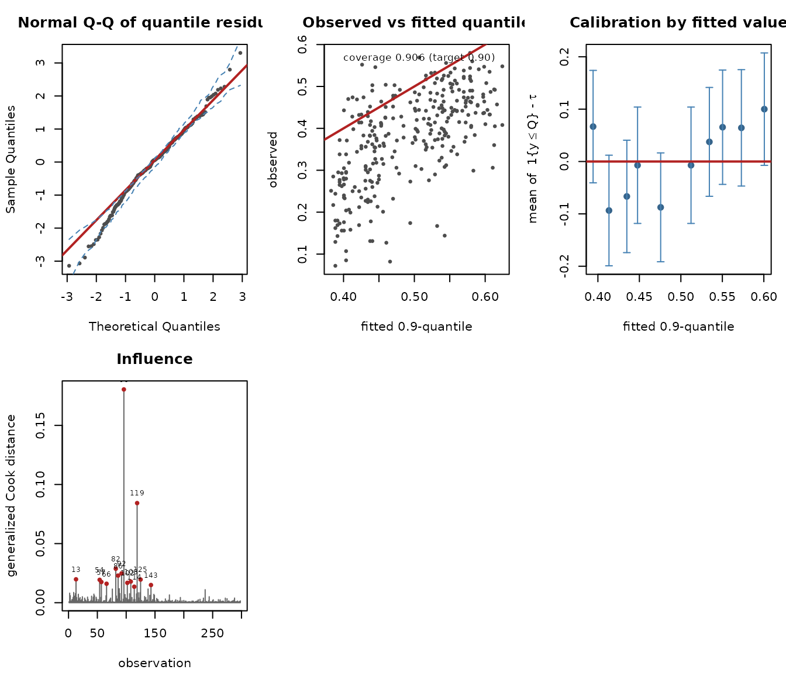
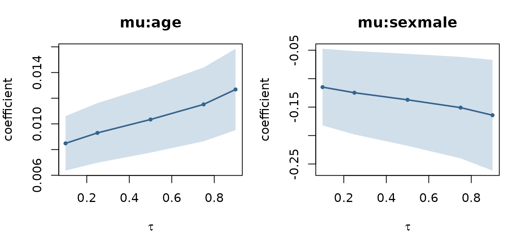

# Case study: upper-quantile body-fat modelling

## The question

`bodyfat` (from `unitquantreg`, n = 298) records the android fat
percentage of participants along with age, sex and physical-activity
level. Android fat — the abdominal deposit — is the fraction clinically
associated with cardiometabolic risk, and the clinical interest is in
the **upper tail**, not the average. A person at the 90th percentile of
android fat for their profile is the one worth flagging.

That is a quantile question, and it is the kind that mean regression
answers only indirectly.

``` r

data("bodyfat", package = "unitquantreg")
str(bodyfat[, c("android", "age", "sex", "ipaq")])
#> 'data.frame':    298 obs. of  4 variables:
#>  $ android: num  0.295 0.432 0.169 0.251 0.285 0.235 0.217 0.275 0.129 0.162 ...
#>  $ age    : int  -28 -28 -28 -28 -27 -27 -27 -26 -26 -26 ...
#>  $ sex    : Factor w/ 2 levels "female","male": 2 1 1 2 2 1 2 1 2 2 ...
#>  $ ipaq   : Factor w/ 3 levels "sedentary","insufficiently active",..: 2 3 3 3 3 3 3 1 3 3 ...
range(bodyfat$android)
#> [1] 0.072 0.580
```

The response lies strictly inside (0,1), so the Generalized Kumaraswamy
family applies directly.

## Fitting the 0.9-quantile

``` r

fit <- gkwqreg(android ~ age + ipaq + sex, data = bodyfat,
               tau = 0.9, family = "kw")
summary(fit)
#> 
#> Generalized Kumaraswamy quantile regression
#> family: kw   tau: 0.9   anchor: beta
#> 
#> Call:
#> gkwqreg(formula = android ~ age + ipaq + sex, data = bodyfat, 
#>     tau = 0.9, family = "kw")
#> 
#> Quantile residuals:
#>     Min      1Q  Median      3Q     Max 
#> -3.1407 -0.5557  0.0579  0.6705  3.3032 
#> 
#> Conditional 0.9-quantile (link logit) -- coefficients are effects on the LOG QUANTILE ODDS log(mu/(1-mu)):
#>                               Estimate Std. Error z value Pr(>|z|)    
#> mu:(Intercept)                0.051005   0.069069   0.738  0.46024    
#> mu:age                        0.012680   0.001617   7.842 4.44e-15 ***
#> mu:ipaqinsufficiently active  0.031385   0.081807   0.384  0.70124    
#> mu:ipaqactive                -0.010905   0.074687  -0.146  0.88392    
#> mu:sexmale                   -0.164254   0.049657  -3.308  0.00094 ***
#> ---
#> Signif. codes:  0 '***' 0.001 '**' 0.01 '*' 0.05 '.' 0.1 ' ' 1
#> 
#> alpha (link log):
#>                   Estimate Std. Error z value Pr(>|z|)    
#> alpha:(Intercept)   1.5144     0.0482   31.42   <2e-16 ***
#> ---
#> Signif. codes:  0 '***' 0.001 '**' 0.01 '*' 0.05 '.' 0.1 ' ' 1
#> 
#> Anchored parameter: beta (computed from the quantile, not estimated)
#> Log-likelihood: 287 on 6 Df   AIC: -562   BIC: -539.8
#> Pinball loss: 0.01432   Pseudo-R1: 0.07911
#> Empirical coverage: 0.906 (target 0.9)
#> Covariance: expected   Information condition number: 7229
```

Reading the quantile block:

- **`age`** is highly significant and positive. Under the logit link the
  coefficient is an effect on the log odds of the conditional
  0.9-quantile.
- **`sexmale`** is strongly negative: at the same age and activity
  level, the upper tail of android fat sits lower for men in this
  sample.
- **`ipaq`** contributes little at this quantile.

The two summary lines worth reading before anything else:

``` r

c(empirical_coverage = mean(bodyfat$android <= fitted(fit)), target = 0.9)
#> empirical_coverage             target 
#>          0.9060403          0.9000000
```

The fit places 90.6% of observations below its fitted quantile against a
target of 90%, and the information-matrix condition number in the
summary is small, so the standard errors mean what they say.

## What the coefficients are worth on the response scale

``` r

marginal_effects(fit)
#> 
#> Marginal effects on the conditional 0.9-quantile (averaged over the sample)
#> dQ(tau|x)/dx_j, logit link
#> 
#>                   variable    effect std.error     lower    upper
#>                        age  0.003111 0.0003868  0.002353  0.00387
#>  ipaqinsufficiently active  0.007701 0.0200692 -0.031634  0.04704
#>                 ipaqactive -0.002676 0.0183266 -0.038595  0.03324
#>                    sexmale -0.040304 0.0121486 -0.064115 -0.01649
```

One additional year of age shifts the conditional 0.9-quantile of
android fat by the amount in the `effect` column — directly
interpretable, unlike the log-odds coefficient.

## Choosing a family: two criteria that disagree

``` r

cmp <- suppressWarnings(
  compare_families(fit, families = c("kw", "ekw", "kkw", "bkw", "beta")))
cmp
#>   family anchor df   logLik       AIC       BIC    pinball converged
#> 1   beta  gamma  6 301.1949 -590.3898 -568.2072 0.01443737      TRUE
#> 2     kw   beta  6 286.9896 -561.9792 -539.7966 0.01432383      TRUE
#> 3    ekw   beta  7 287.9018 -561.8037 -535.9240 0.01396188      TRUE
#> 4    bkw   beta  8 288.0123 -560.0246 -530.4478 0.01394496      TRUE
#> 5    kkw   beta  8 287.9018 -559.8037 -530.2269 0.01396189      TRUE
```

This is worth dwelling on, because it is the situation the documentation
warns about. **AIC ranks `beta` first while check loss ranks it last**,
behind every Kumaraswamy member. The two disagree because they measure
different things: AIC scores the whole conditional density, check loss
scores only the quantile being estimated. A family can describe the bulk
of the distribution well — which is what buys it the likelihood — and
still place the 0.9-quantile worse than a rival that fits the bulk less
well.

For a quantile question the check loss is the criterion that matches the
goal — but it must be computed **out of sample**, or it simply rewards
flexibility:

``` r

set.seed(1)
folds <- sample(rep(1:5, length.out = nrow(bodyfat)))
cv <- sapply(c("kw", "ekw", "bkw", "beta"), function(fam) {
  mean(sapply(1:5, function(k) {
    tr <- bodyfat[folds != k, ]; te <- bodyfat[folds == k, ]
    f <- suppressWarnings(try(gkwqreg(android ~ age + ipaq + sex, data = tr,
                                      tau = 0.9, family = fam), silent = TRUE))
    if (inherits(f, "try-error")) return(NA_real_)
    pinball(f, newdata = te)
  }), na.rm = TRUE)
})
round(cv, 6)
#>       kw      ekw      bkw     beta 
#> 0.014742 0.014257 0.014254 0.014583
```

Five-fold cross-validated check loss is the number to act on.

## Where the model fits badly

``` r

plot(fit, which = c(3, 4, 5, 6), nsim = 50)
```



Panel 5 is the one specific to quantile regression. It bins the
`tau`-sign residuals 1\\y_i \le \hat Q_i\\ - \tau by fitted value. Under
a correctly specified model each bin mean is zero, and the bars are 95%
binomial intervals — so a bin whose interval excludes zero is direct,
distribution-free evidence that the fit is miscalibrated in that part of
the covariate space.

## Across the distribution

The effect of age need not be constant across quantiles. That is the
whole reason to fit more than one.

``` r

fits <- suppressWarnings(
  gkwqreg(android ~ age + ipaq + sex, data = bodyfat,
          tau = c(0.1, 0.25, 0.5, 0.75, 0.9), family = "kw"))
qp <- quantile_process(fits)
plot(qp, parm = c("mu:age", "mu:sexmale"))
```



``` r

check_crossing(fits)
#> 
#> Quantile crossing check
#> levels: 0.10, 0.25, 0.50, 0.75, 0.90
#> source: independently fitted models, one per level
#> 
#>   rows with a crossing: 0 of 298 (0.00%)
#>   worst violation     : 0.000e+00
```

If the independently fitted levels cross anywhere,
[`rearrange()`](https://evandeilton.github.io/gkwqreg/reference/rearrange.md)
restores monotonicity:

``` r

R <- rearrange(fits)
all(apply(R, 1, function(r) all(diff(r) >= 0)))
#> [1] TRUE
```

## Modelling the shape as well

Section 1.5 of the design notes recommends regressing the nuisance
parameter on the same covariates as the quantile whenever theory does
not dictate an anchor. Doing so makes the fit robust to the anchor
choice, and here it also tests whether the *spread* of android fat
varies with age:

``` r

fit_het <- gkwqreg(android ~ age + ipaq + sex | age, data = bodyfat,
                   tau = 0.9, family = "kw")
anova(fit, fit_het)
#> Likelihood-ratio test for Generalized Kumaraswamy quantile regression
#> tau = 0.9, anchor = beta
#>      Df logLik     AIC  Chisq Chi Df Pr(>Chisq)    
#> [1,]  6 286.99 -561.98                             
#> [2,]  7 321.85 -629.70 69.723      1  < 2.2e-16 ***
#> ---
#> Signif. codes:  0 '***' 0.001 '**' 0.01 '*' 0.05 '.' 0.1 ' ' 1
```

``` r

fa <- gkwqreg(android ~ age + ipaq + sex | age, data = bodyfat,
              tau = 0.9, family = "kw", anchor = "alpha")
rbind(beta_anchor  = coef(fit_het)[c("mu:age", "mu:sexmale")],
      alpha_anchor = coef(fa)[c("mu:age", "mu:sexmale")])
#>                   mu:age mu:sexmale
#> beta_anchor  0.003873378 -0.1938826
#> alpha_anchor 0.004073733 -0.1801923
```

With the nuisance parameter saturated, the two anchors agree closely —
which is exactly the point of the recommendation: it removes the
dependence on a choice you have no strong grounds to make.

## Robust standard errors

If you doubt the distributional assumption but still want the parametric
fit, the sandwich estimator is available, and `sandwich`/`lmtest` work
directly:

``` r

round(cbind(model = sqrt(diag(vcov(fit))),
            sandwich = sqrt(diag(vcov(fit, type = "sandwich")))), 5)
#>                                model sandwich
#> mu:(Intercept)               0.06907  0.04763
#> mu:age                       0.00162  0.00148
#> mu:ipaqinsufficiently active 0.08181  0.06971
#> mu:ipaqactive                0.07469  0.05480
#> mu:sexmale                   0.04966  0.04820
#> alpha:(Intercept)            0.04820  0.05684
```

A large gap between the two columns is itself a specification warning.

## Summary

The workflow this vignette follows is the one to reuse:

1.  Fit at the quantile level the question is about.
2.  Check empirical coverage and the condition number in
    [`summary()`](https://rdrr.io/r/base/summary.html).
3.  Choose the family by **out-of-sample check loss**, not AIC alone.
4.  Read effects on the response scale with
    [`marginal_effects()`](https://evandeilton.github.io/gkwqreg/reference/marginal_effects.md).
5.  Check calibration with panel 5, not just the Q-Q plot.
6.  Saturate the nuisance parameters, and confirm the anchor no longer
    matters.
