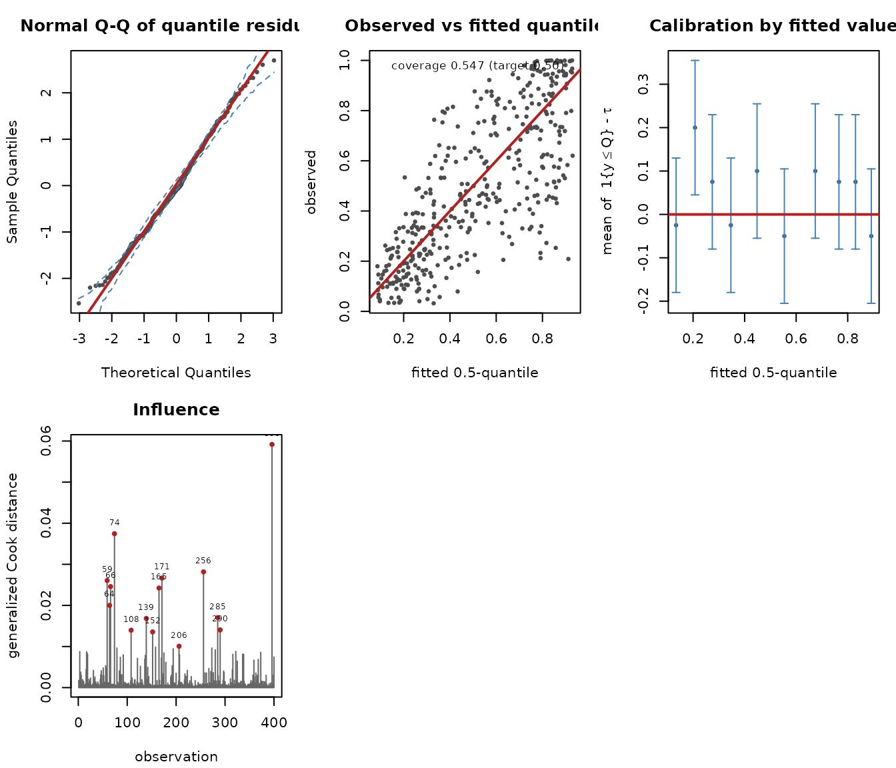
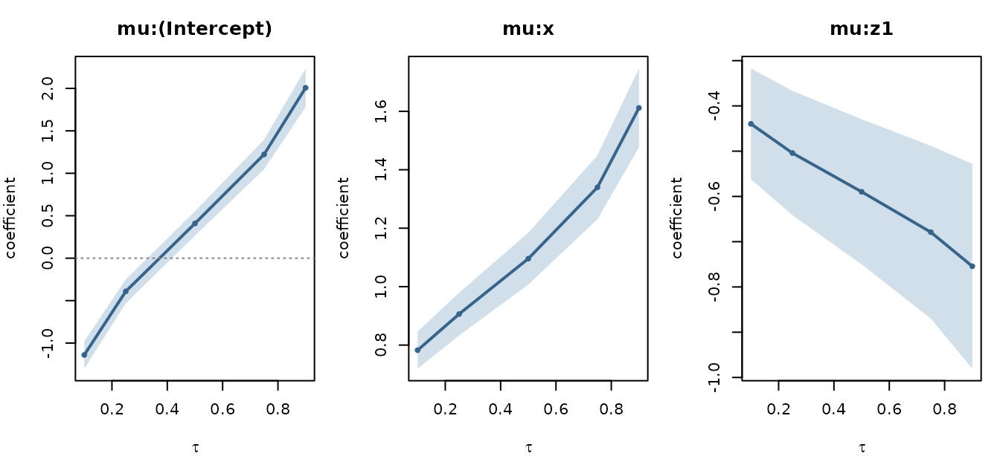

# Getting started with gkwqreg

## The question this package answers

Suppose a response lies strictly between 0 and 1 — a yield, a
proportion, an index — and you care about its upper tail rather than its
average. Two families of tools exist.

**Check-function quantile regression**
([`quantreg::rq`](https://rdrr.io/pkg/quantreg/man/rq.html)) is
distribution-free and indexed by a quantile level `tau`. It is the
reference method and it stays consistent even when you have no idea what
the conditional distribution looks like.

**Distributional regression** (`gkwreg`, `betareg`, `gamlss`) fits a
full parametric model for the conditional distribution, and can report
quantiles afterwards by applying the quantile function to the fitted
parameters. That answers *“given the fitted distribution, what is its
90th percentile?”*

Neither answers *“how do covariates shift the 90th percentile?”* with a
coefficient you can read off and a standard error that refers to it. The
first has no likelihood; the second has no parameter that **is** the
90th percentile.

`gkwqreg` fixes `tau` in advance and reparametrizes the distribution so
that one of its parameters is exactly the conditional `tau`-quantile.

## A first fit

``` r

n  <- 400
x  <- runif(n, -2, 2)
z  <- rbinom(n, 1, 0.5)
mu <- plogis(0.4 + 1.1 * x - 0.6 * z)          # the conditional MEDIAN
y  <- gkwdist::rkw(n, alpha = 2, beta = log1p(-0.5) / log1p(-mu^2))
dat <- data.frame(y = y, x = x, z = factor(z))
```

The data are generated so that `plogis(0.4 + 1.1 x - 0.6 z)` is the
conditional median. Fitting at `tau = 0.5` should recover those numbers.

``` r

fit <- gkwqreg(y ~ x + z, data = dat, tau = 0.5, family = "kw")
summary(fit)
#> 
#> Generalized Kumaraswamy quantile regression
#> family: kw   tau: 0.5   anchor: beta
#> 
#> Call:
#> gkwqreg(formula = y ~ x + z, data = dat, tau = 0.5, family = "kw")
#> 
#> Quantile residuals:
#>     Min      1Q  Median      3Q     Max 
#> -2.5379 -0.6547 -0.0864  0.7107  2.6987 
#> 
#> Conditional 0.5-quantile (link logit) -- coefficients are effects on the LOG QUANTILE ODDS log(mu/(1-mu)):
#>                Estimate Std. Error z value Pr(>|z|)    
#> mu:(Intercept)  0.40895    0.07330   5.579 2.42e-08 ***
#> mu:x            1.09564    0.04521  24.236  < 2e-16 ***
#> mu:z1          -0.58971    0.08181  -7.208 5.67e-13 ***
#> ---
#> Signif. codes:  0 '***' 0.001 '**' 0.01 '*' 0.05 '.' 0.1 ' ' 1
#> 
#> alpha (link log):
#>                   Estimate Std. Error z value Pr(>|z|)    
#> alpha:(Intercept)  0.71665    0.05258   13.63   <2e-16 ***
#> ---
#> Signif. codes:  0 '***' 0.001 '**' 0.01 '*' 0.05 '.' 0.1 ' ' 1
#> 
#> Anchored parameter: beta (computed from the quantile, not estimated)
#> Log-likelihood: 218.5 on 4 Df   AIC: -429.1   BIC: -413.1
#> Pinball loss: 0.07309   Pseudo-R1: 0.4099
#> Empirical coverage: 0.5475 (target 0.5)
#> Covariance: expected   Information condition number: 14.7
```

Three things in that output are worth pausing on.

**The header** names the family, the quantile level and the anchored
parameter. All three change what the model *is*, so none of them is
hidden.

**The coefficient block for `mu`** is labelled as effects on the log
quantile odds, not on a mean and not on the odds of an event. This is
the most likely thing for a reader to get wrong.

**Empirical coverage** reports the fraction of observations below the
fitted quantile. It should sit at `tau`, and it is the cheapest
available check that the fit is doing what it claims.

## The formula has one part per modelled parameter

Part one is always the conditional quantile. The remaining parts follow
the family’s parameter order with the anchored parameter removed.
[`gkwq_parts()`](https://evandeilton.github.io/gkwqreg/reference/gkwq_parts.md)
is the contract:

``` r

gkwq_parts("kw")
#> [1] "mu"    "alpha"
gkwq_parts("ekw")
#> [1] "mu"     "alpha"  "lambda"
gkwq_parts("gkw")
#> [1] "mu"     "alpha"  "gamma"  "delta"  "lambda"
```

So for `kw` the second part is `alpha`:

``` r

fit_het <- gkwqreg(y ~ x + z | x, data = dat, tau = 0.5, family = "kw")
```

Omitted trailing parts default to `~ 1`. Supplying **more** parts than
the family has is an error that names the parts it expected, rather than
silently ignoring the extras.

## What the coefficients mean

``` r

marginal_effects(fit)
#> 
#> Marginal effects on the conditional 0.5-quantile (averaged over the sample)
#> dQ(tau|x)/dx_j, logit link
#> 
#>  variable  effect std.error   lower    upper
#>         x  0.2005  0.004448  0.1918  0.20926
#>        z1 -0.1079  0.014756 -0.1369 -0.07902
```

`exp(coef(fit)["mu:x"])` is the multiplicative effect on the odds of the
conditional median.
[`marginal_effects()`](https://evandeilton.github.io/gkwqreg/reference/marginal_effects.md)
converts that to the effect on the median itself,
`beta_j * mu * (1 - mu)` under the logit link.

There is a small bonus in this parametrization. If a covariate appears
in *both* the quantile part and a nuisance part, the effect on the
quantile is still exactly the expression above, because `mu` **is** the
quantile — the nuisance part changes the spread of the conditional
distribution, not the quantile being modelled.
[`marginal_effects()`](https://evandeilton.github.io/gkwqreg/reference/marginal_effects.md)
says so when it detects the overlap.

## Choosing a family

The seven families are genuinely nested, so a likelihood-ratio test
applies:

``` r

fit_kw  <- gkwqreg(y ~ x + z, data = dat, tau = 0.5, family = "kw")
fit_ekw <- gkwqreg(y ~ x + z, data = dat, tau = 0.5, family = "ekw")
anova(fit_kw, fit_ekw)
#> Likelihood-ratio test for Generalized Kumaraswamy quantile regression
#> tau = 0.5, anchor = beta
#>      Df logLik     AIC  Chisq Chi Df Pr(>Chisq)
#> [1,]  4 218.54 -429.09                         
#> [2,]  5 218.70 -427.41 0.3199      1     0.5716
```

For an out-of-sample choice, prefer the pinball loss: it is the
criterion a quantile estimate actually targets, whereas AIC compares
likelihoods.

``` r

compare_families(fit_kw, families = c("kw", "ekw", "bkw", "beta"))
#>   family anchor df    logLik       AIC       BIC    pinball converged
#> 1     kw   beta  4 218.54268 -429.0854 -413.1195 0.07309073      TRUE
#> 2    ekw   beta  5 218.70265 -427.4053 -407.4480 0.07307413      TRUE
#> 3    bkw   beta  6 218.70265 -425.4053 -401.4565 0.07307413      TRUE
#> 4   beta  gamma  4  91.95507 -175.9101 -159.9443 0.07996509      TRUE
```

## Diagnostics

``` r

head(residuals(fit, type = "quantile"))
#>          1          2          3          4          5          6 
#> -1.2276386  0.2353487 -1.8771430  1.3929028  1.4770079  1.3762688
head(residuals(fit, type = "tau-sign"))
#> [1]  0.5 -0.5  0.5 -0.5 -0.5 -0.5
```

`"quantile"` residuals are standard normal under correct specification
and are the default. `"tau-sign"` is specific to quantile regression:
under a correctly specified model `E[1{Y <= Q_tau(X)} | X] = tau`
exactly, so binning these by any covariate and testing for a zero mean
is a distribution-free calibration check with no analogue in mean
regression. Panel 5 of the diagnostic plot draws it.

``` r

plot(fit, which = c(3, 4, 5, 6), nsim = 50)
```



## Several quantile levels

Each level is a separate likelihood, so a vector `tau` returns a
container of independent fits rather than one pooled object.

``` r

fits <- gkwqreg(y ~ x + z, data = dat, tau = c(0.1, 0.25, 0.5, 0.75, 0.9),
                family = "kw")
round(coef(fits), 3)
#>                     0.10   0.25   0.50   0.75   0.90
#> mu:(Intercept)    -1.140 -0.391  0.409  1.223  2.007
#> mu:x               0.782  0.906  1.096  1.340  1.612
#> mu:z1             -0.440 -0.504 -0.590 -0.679 -0.754
#> alpha:(Intercept)  0.694  0.709  0.717  0.713  0.700
```

``` r

plot(quantile_process(fits), parts = "mu")
```



The coefficient path shows how the effect of `x` changes across the
distribution — the picture quantile regression exists to produce.

## Crossing

Independently fitted levels carry no guarantee that fitted quantiles
increase with `tau`:

``` r

check_crossing(fits)
#> 
#> Quantile crossing check
#> levels: 0.10, 0.25, 0.50, 0.75, 0.90
#> source: independently fitted models, one per level
#> 
#>   rows with a crossing: 0 of 400 (0.00%)
#>   worst violation     : 0.000e+00
```

A *single* fit cannot cross, because its quantiles are those of one
proper distribution function:

``` r

check_crossing(fit, taus = seq(0.1, 0.9, by = 0.1))
#> 
#> Quantile crossing check
#> levels: 0.1, 0.2, 0.3, 0.4, 0.5, 0.6, 0.7, 0.8, 0.9
#> source: quantiles implied by ONE fitted distribution
#> 
#>   rows with a crossing: 0 of 400 (0.00%)
#>   worst violation     : 0.000e+00
#> 
#>   Zero crossings is guaranteed here, not luck: these are quantiles of
#>   a single proper distribution function. That guarantee is what a
#>   parametric fit buys over independently fitted levels.
```

If separate fits do cross,
[`rearrange()`](https://evandeilton.github.io/gkwqreg/reference/rearrange.md)
applies the monotone rearrangement of Chernozhukov, Fernández-Val and
Galichon (2010).

## Where to go next

The companion vignette, *The anchor, and why it is a modeling choice*,
covers the reparametrization itself, the identifiability constraints,
and the one decision in this package that changes your answers rather
than your arithmetic.
